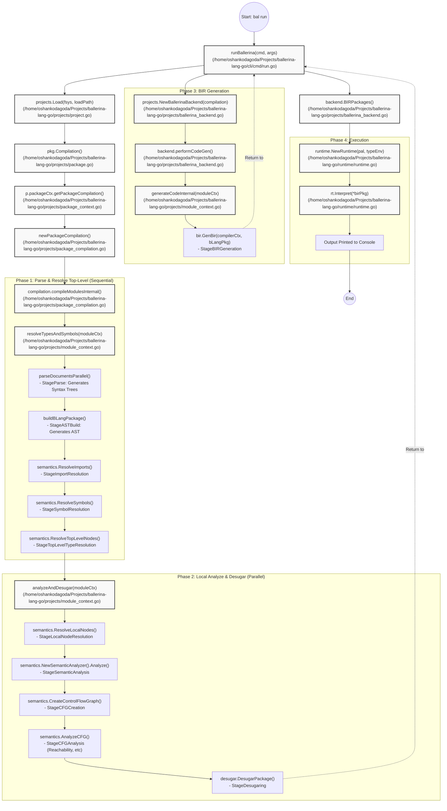

This document maps out the exact sequence of function calls and file transitions when you execute a Ballerina file using the CLI (`go run ./cli/cmd run path/to/file.bal`). 

The diagram captures the flow from the initial CLI invocation, through the various compilation stages, and finally to the interpreter execution.

## Execution Flowchart

## Detailed Flow Breakdown and Absolute File Paths

### 1. CLI and Project Loading Phase
- **`runBallerina(cmd, args)`** 
  `/home/oshankodagoda/Projects/ballerina-lang-go/cli/cmd/run.go`
- **`projects.Load(fsys, loadPath)`** 
  `/home/oshankodagoda/Projects/ballerina-lang-go/projects/project.go`
- **`pkg.Compilation()`** 
  `/home/oshankodagoda/Projects/ballerina-lang-go/projects/package.go`
- **`p.packageCtx.getPackageCompilation()`** 
  `/home/oshankodagoda/Projects/ballerina-lang-go/projects/package_context.go`
- **`newPackageCompilation()`** & **`compilation.compileModulesInternal()`**
  `/home/oshankodagoda/Projects/ballerina-lang-go/projects/package_compilation.go`

### 2. Compilation Phase 1 (Sequential)
*Orchestrated primarily inside `/home/oshankodagoda/Projects/ballerina-lang-go/projects/module_context.go` via `resolveTypesAndSymbols()`:*
- **`parseDocumentsParallel()`** 
  `/home/oshankodagoda/Projects/ballerina-lang-go/projects/module_context.go`
- **`buildBLangPackage()`** 
  `/home/oshankodagoda/Projects/ballerina-lang-go/projects/module_context.go`
- **`semantics.ResolveImports()`** 
  `/home/oshankodagoda/Projects/ballerina-lang-go/semantics/symbol_resolver.go`
- **`semantics.ResolveSymbols()`** 
  `/home/oshankodagoda/Projects/ballerina-lang-go/semantics/symbol_resolver.go`
- **`semantics.ResolveTopLevelNodes()`** 
  `/home/oshankodagoda/Projects/ballerina-lang-go/semantics/type_resolver.go`

### 3. Compilation Phase 2 (Parallel / Goroutines)
*Orchestrated primarily inside `/home/oshankodagoda/Projects/ballerina-lang-go/projects/module_context.go` via `analyzeAndDesugar()`:*
- **`semantics.ResolveLocalNodes()`** 
  `/home/oshankodagoda/Projects/ballerina-lang-go/semantics/type_resolver.go`
- **`semantics.NewSemanticAnalyzer().Analyze()`** 
  `/home/oshankodagoda/Projects/ballerina-lang-go/semantics/semantic_analyzer.go`
- **`semantics.CreateControlFlowGraph()`** 
  `/home/oshankodagoda/Projects/ballerina-lang-go/semantics/control_flow_analyzer.go`
- **`semantics.AnalyzeCFG()`** 
  `/home/oshankodagoda/Projects/ballerina-lang-go/semantics/cfg_analyzer.go`
- **`desugar.DesugarPackage()`** 
  `/home/oshankodagoda/Projects/ballerina-lang-go/desugar/desugar.go`

### 4. BIR (Bytecode) Generation Phase
- **`projects.NewBallerinaBackend()`** & **`backend.performCodeGen()`**
  `/home/oshankodagoda/Projects/ballerina-lang-go/projects/ballerina_backend.go`
- **`generateCodeInternal()`**
  `/home/oshankodagoda/Projects/ballerina-lang-go/projects/module_context.go`
- **`bir.GenBir()`**
  `/home/oshankodagoda/Projects/ballerina-lang-go/bir/bir_gen.go`

### 5. Runtime / Execution Phase
- **`backend.BIRPackages()`**
  `/home/oshankodagoda/Projects/ballerina-lang-go/projects/ballerina_backend.go`
- **`runtime.NewRuntime()`** & **`rt.Interpret()`**
  `/home/oshankodagoda/Projects/ballerina-lang-go/runtime/runtime.go`